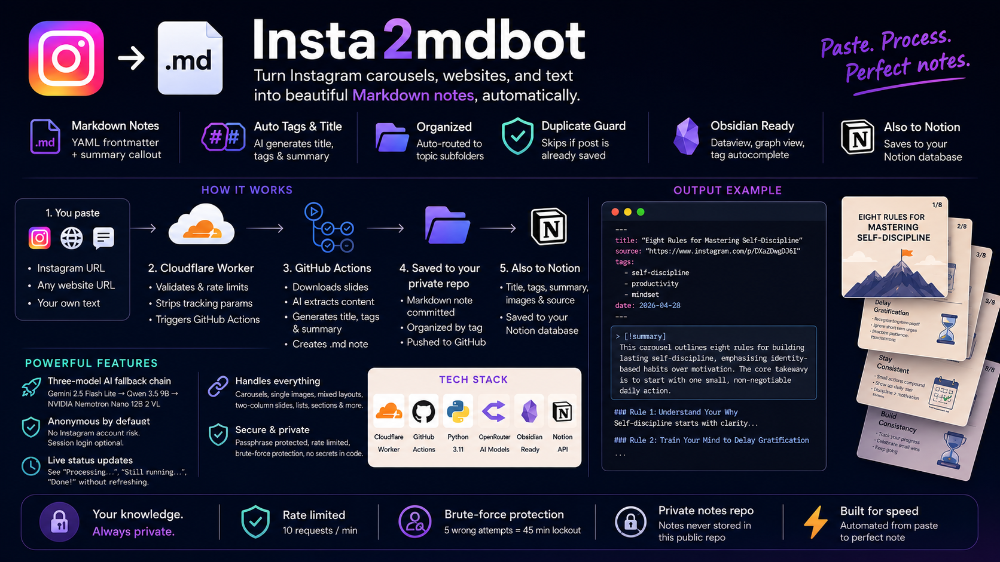

# INSTA_TO_MD_BOT

Convert Instagram carousels into clean, structured Markdown notes - automatically.

**Live app:** https://wsnh2022.github.io/insta2mdbot/

---

## What it does

Paste any Instagram post URL → the app downloads every slide of the carousel, extracts all meaningful text using a vision AI model, and saves a formatted `.md` note to a private GitHub repository. Takes about 2 minutes per post.

- Paste URLs with or without tracking params (`?utm_source=...`) - they are stripped automatically
- Handles carousels, single images, and mixed layouts
- Two-column comparison slides (Basic → Advanced, Before → After) are formatted as Markdown tables
- Named sections (Rule #1: Title, Step 1: Do X) become `###` headers
- Numbered tips without titles become clean numbered lists
- Decorative icons, slide counters, @handles, and promotional text are removed
- AI generates a human-readable title and topic tags for every note
- If the primary model is rate-limited (429), retries with backoff (10s → 30s → 60s) before falling to the next model
- Three-model fallback chain - Gemini 2.5 Flash Lite → Qwen 3.5 9B → NVIDIA Nemotron Nano 12B 2 VL

**Output example:**

```markdown
# Eight Rules for Mastering Self-Discipline

**Source:** https://www.instagram.com/p/DXaZDwgDJ6I
**Tags:** #self-discipline #productivity #mindset
**Date:** 2026-04-28

---

### Rule 1: Understand Your Why
Self-discipline starts with clarity...

### Rule 2: Train Your Mind to Delay Gratification
...
```

---

## How it works

```
GitHub Pages form
      ↓  POST { instagram_url } + passphrase header
Cloudflare Worker
      ↓  validates passphrase
      ↓  rate limits (10 req/min)
      ↓  strips tracking params, builds clean URL
      ↓  triggers GitHub Actions via API
GitHub Actions runner (ubuntu)
      ↓  checks out private notes repo → notes/
      ↓  downloads carousel slides via instaloader
      ↓  resizes each slide to max 768px (Pillow)
      ↓  sends all slides to OpenRouter vision model → extracted text
      ↓  second AI call → title + tags (JSON)
      ↓  builds .md note with title-based filename
      ↓  commits and pushes to private notes repo
github.com/YOUR_USERNAME/YOUR_NOTES_REPO (private)
```

---

## Stack

| Layer | Technology |
|-------|-----------|
| Frontend | GitHub Pages - vanilla HTML/CSS/JS |
| API gateway | Cloudflare Worker (passphrase auth + rate limiting) |
| Backend | GitHub Actions + Python 3.11 |
| Image download | instaloader 4.15.1 |
| Image resize | Pillow 10.4.0 (768px max before API call) |
| AI extraction | OpenRouter - Gemini 2.5 Flash Lite (primary) → Qwen 3.5 9B → NVIDIA Nemotron Nano 12B 2 VL (fallbacks) |
| AI metadata | OpenRouter - title + tags from extracted text |
| Note storage | Separate private GitHub repo |

---

## Security

| Protection | How |
|-----------|-----|
| Passphrase on form | Worker rejects all requests without `X-Access-Key` header matching `ACCESS_KEY` secret |
| Rate limiting | Max 10 requests per minute on the Worker |
| Private notes | Notes committed to a separate private repo - never in this public repo |
| No secrets in code | GitHub PAT → Cloudflare Worker secret. OpenRouter key → GitHub Actions secret |
| URL sanitisation | Worker strips all tracking params before passing URL to Actions |

---

## Repository structure

```
insta2mdbot/
├── docs/                        # GitHub Pages frontend
│   ├── index.html               # Form UI (passphrase + URL fields)
│   ├── app.js                   # Submits to Worker with X-Access-Key header
│   └── style.css
├── worker/
│   ├── index.js                 # Cloudflare Worker - auth, rate limit, URL clean, trigger
│   └── wrangler.toml            # Worker config (account_id, env vars)
├── scripts/
│   └── process.py               # Download → resize → extract → metadata → build note
├── .github/workflows/
│   └── process_post.yml         # Checks out notes repo, runs process.py, pushes note
├── redeploy.bat                 # One-click Worker redeployment (reads .cloudflare-token)
├── requirements.txt             # instaloader, requests, Pillow
├── SETUP.md                     # Full setup guide with all known gotchas
└── .cloudflare-token            # Your Cloudflare API token - gitignored, create manually
```

---

## Quick redeploy

Any change to `worker/index.js` requires redeploying the Worker to go live.

1. Create `.cloudflare-token` in the project root with your Cloudflare API token as the only content
2. Double-click `redeploy.bat`

---

## Dependencies

```
instaloader==4.15.1
requests==2.31.0
Pillow==10.4.0
```

---

## Limitations

Designed for personal use - realistically 20–30 posts/day.

### Cloudflare Worker
| Limit | Value | Notes |
|---|---|---|
| Rate limit | 10 req/min | Counts form submissions (URLs), not carousel slides - a 15-slide post is still 1 request |
| Free tier | 100,000 req/day | Far above any personal use |

### GitHub Actions
| Limit | Value | Notes |
|---|---|---|
| Minutes/month | Unlimited | Workflow runs on a public repo |
| Run duration | ~2–3 min/post | Includes Python setup and pip install each time |

### OpenRouter (AI models)
| Model | Role | Notes |
|---|---|---|
| Gemini 2.5 Flash Lite | Primary | Fastest, lowest cost |
| Qwen 3.5 9B | Fallback 1 | Multimodal vision, low cost |
| NVIDIA Nemotron Nano 12B 2 VL | Fallback 2 | Explicitly handles multi-image documents |

At 20–30 posts/day spread across the day, rate limits are rarely hit. If all three models fail, the chain automatically retries — waiting 1 min then 3 min — before giving up.

### Instagram / instaloader
| Limit | Value | Notes |
|---|---|---|
| Official API | None | Instaloader scrapes without OAuth |
| 403 blocks | Unpredictable | GitHub Actions IPs are datacenter IPs - Instagram flags them occasionally |
| Safe pace | 1 post every 2–3 min | Sustained rapid requests risk a temporary IP block on the runner |

The weakest point in the stack. A 403 from Instagram means that run fails - just re-submit the URL a few minutes later.

---

## Full setup guide

See [SETUP.md](SETUP.md) for step-by-step instructions including all issues encountered during the original setup and exactly how to fix them.
